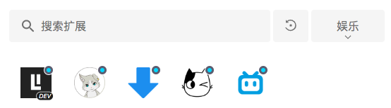
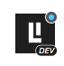
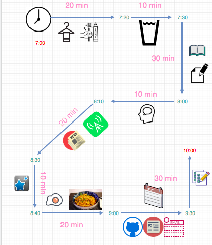
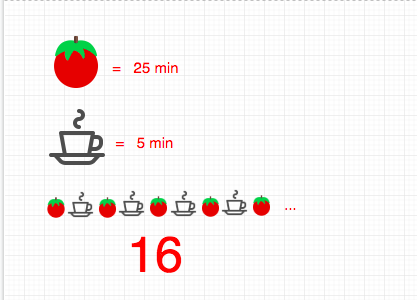
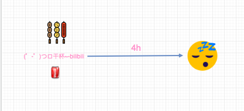
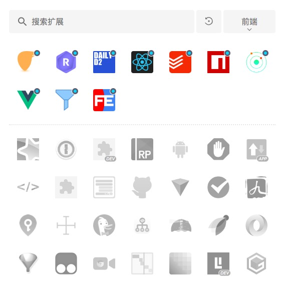
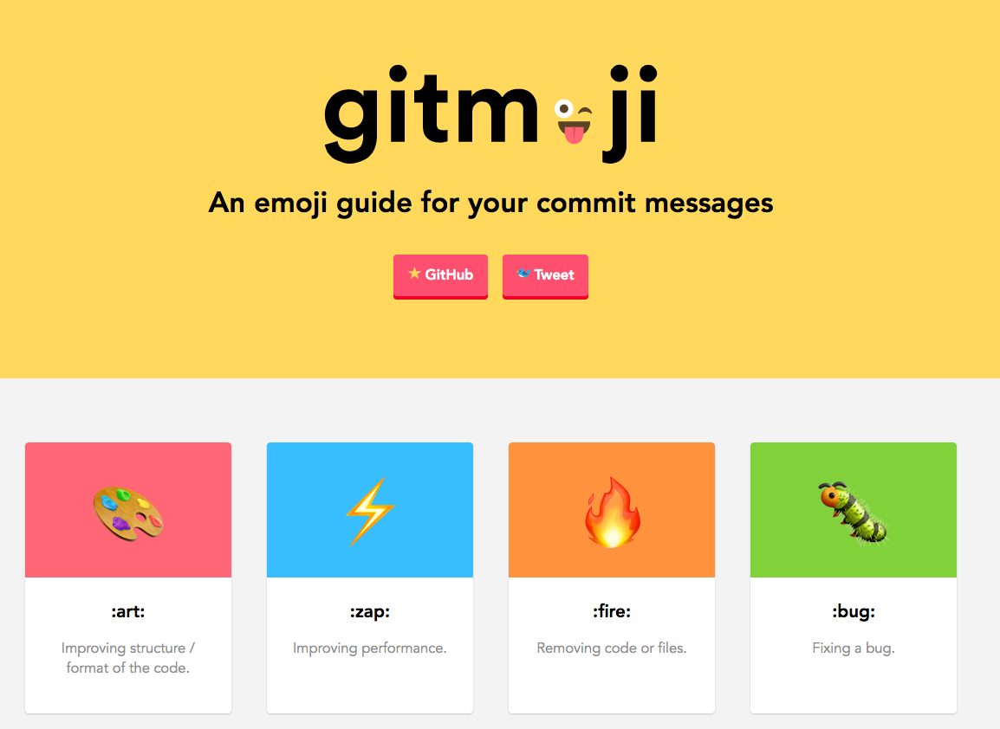

# 每日一荐

> 统计数据的时间是从 2019-09-15 16:50 起至今

每天给你推荐一个新奇，好玩，高品质的开源库，好文，观点或言论等。

> 项目主页维护当前月份的内容，想看往期内容，可以翻到下方历史汇总部分，然后选择自己感兴趣的月份点进去即可。

## 新鲜出炉(2019-09)

### 2019-19[工具推荐 - 软件]

今天给大家推荐一款MarkDown编辑器。 MarkDown在程序员中的使用频率是非常高的，Github是最早一批对MarkDown语法支持度比较好的平台之一。我日常写文档，记笔记等都采用MarkDown格式来书写。 它不仅书写方便，而且由于其格式比较规范，因此理论上可以通过一些“转换规则”将其转化为各种表现形式，市面上也有很多基于Markdown的渲染器，比如[markdown-it](https://github.com/markdown-it/markdown-it)，也有很多基于这些渲染器制作的产品，比如[docsify](https://github.com/docsifyjs/docsify)。

早些时候，我使用的比较多的是[MacDown](https://macdown.uranusjr.com)和VSCode自带的Markdown功能。这两个功能非常简单，但是却能满足我当时的需求，之后我开始经常用Markdown更新文章之类的，因此这些就显得不太够用了，现在我用的是Yu Writer， 算是一个值得推荐的国人开发的MarkDown编辑器，功能非常强大而且免费。 你可能听过MWeb，但是它是收费的，功能和这个比起来也并不占优势。

下载地址：https://ivarptr.github.io/yu-writer.site/

### 2019-09-18[工具推荐 - 插件]

前天分享了我的 chrome 插件管理器，今天我们就来分享我的《娱乐插件》。

1. listen1

娱乐插件第一个要分享的是一个听歌的插件，各个平台都有一些独家的音乐，就像视频网站一样，这就可怜了我们这些消费者。
如果想要听所有的音乐就要办理各个 APP 的会员，或者在多个音乐 APP 中切换。

这个插件能让我们听到所有国内几个主流大平台的所有音乐，足不出户畅享所有的音乐，并且值得称赞的是它支持会员系统，你可以保存
你的歌单，甚至可以直接登陆你的 Github 账户同步多端的数据。

仓库地址：https://github.com/listen1/listen1

2. Video Downloader Professional

我主要用它来下载 Youtube 的视频，据说可以下载任何视频网站的视频，但是我亲测了几个网站不可以。

扩展下载地址：https://chrome.google.com/webstore/detail/jpaglkhbmbmhlnpnehlffkgaaapoicnk

3. Bilibili 全家桶

经常看番的朋友怎么能少的了几个好用的插件护体呢？

这几个插件的功能基本满足了我看番的所有需求，包括弹幕合并，查找弹幕，自动签到，一键直达，猜你喜欢等等，大家可以安装下自己体验。

[bilibili 助手](https://chrome.google.com/webstore/detail/kpbnombpnpcffllnianjibmpadjolanh)

[pakku 哔哩哔哩弹幕过滤器](http://s.xmcp.ml/pakkujs/?src=wext_homepage)

[bilibili 猜你喜欢](https://chrome.google.com/webstore/detail/ngjddnobeppdekpmimhiamkoonoaccdf)

### 2019-09-17[学习方法]

很多人想要问我“你的成长史是怎么样的？能不能分享一下你的菜鸡成长史”。 开始我是抵触的，这种东西写的不好大家会骂你，写的“太好”也会骂你。

今天我就来做个“lucifer”系列的开篇吧，用图来描述“lucifer 的一天”。

lucifer 的早晨：

lucifer 搬砖的一天开始了：

lucifer 的晚上：

### 2019-09-16[工具推荐 - 插件]

经常有同学问我“你的这个扩展看着不错，叫什么”， “有什么好用的扩展程序推荐么？”。

因此我打算出一个《工具推荐》专题， 然后细分一个类别《工具推荐 - chrome 插件》。 这个算是这个系列的开篇之作，我默默翻开自己的 chrome 插件列表来看，
有什么好用的推荐给大家。突然灵机一动，干脆把这个“扩展插件管理器”安利给大家好了。之后我会向大家推荐更多好用好玩的插件，有“工具”，“效率”， “娱乐”，“前端”等等。

我的 chrome 插件差不多有 60 多个，插件多起来的时候，良好的分类，开启关闭，禁用，卸载等管理就变得非常重要了。
毕竟谁也不想在众多插件中寻寻觅觅的感觉，也不想因为开启太多插件吃我们宝贵的内存吧？
这个插件的名字是[扩展管理器（Extension Manager)](https://chrome.google.com/webstore/detail/extension-manager/gjldcdngmdknpinoemndlidpcabkggco)

> 对于没有梯子的同学，我还贴心地给大家准备了我从官方下载的扩展文件。 [链接](./assets/2019-09/extension-manager.crx)

### 2019-09-12[工具推荐 - 类库]

今天给大家推荐的是一个在给 Git 提交记录增加 emojis 的仓库。

或许你知道[AngularJS Git Commit Message Conventions](https://gist.github.com/stephenparish/9941e89d80e2bc58a153) , 现在很多开源项目和内部项目都在使用
，是一道非常流行的 git commit message 规范。 它的好处就是你可以很轻松地通过提交信息，看出`这次提交干的什么，影响范围等`，比如是新特性，修复 bug，增加文档， 重构代码等。

这个项目可以说更进一步，通过图的形式，让你更快地感知到这些信息，`可视化形式的沟通毫无疑问是最最有效的。因为人的大脑更擅长处理图像。` 项目提供了几十种 emoji，几乎覆盖了所有的场景。 仓库地址： [https://gitmoji.carloscuesta.me/](https://gitmoji.carloscuesta.me/)

### 2019-09-11[技能]

Google 内部有很多通用的最佳实践，在这我推荐一个项目，这是挂在 google group 下的一套通用的工程实战指南，被各个项目广泛使用，覆盖全部的编程语言。

这个仓库分成两部分：

1.  这部分是给 Code Reviewer（代码评审者）的指南

2.  这部分是给 Change Author（CL 作者）的指南

代码评审者指南本来是一个完整的文档，一共分为 6 部分，读者可根据需要阅读。

修改列表（Change List/CL）制定者指南包括一些浏览代码评审的最佳方式，开发者可以快速处理评审结果。

项目地址： https://github.com/google/eng-practices

### 2019-09-10[工具推荐 - 类库]

今天给大家推荐的是一个打包平台，不知道大家有没有听说过“polyfill.io”，用法有点像。

这个仓库是 fork 自 packed，并进行了魔改，你可以将多个包打包成一个单独的 ESM，支持多种 options， 仓库地址： https://github.com/webcomponents-dev/packd-es

### 2019-09-09[工具推荐 - 类库]

一个可以将草稿转化 HTML 的工具，利用了机器学习来生成页面。 你可以手画一些东西，然后将其直接生成静态页面。缺点也很明显，一方面是静态的，因此没有什么交互，对于交互强的应用没什么用。
其次就是生成的是 HTML，可维护性会比较差，如果生成类似 JSX 这样的中间产物可能会好一点。当然市面上其实已经有了生成 JSX 产物的开源框架了。 地址：https://github.com/ashnkumar/sketch-code

### 2019-09-06[学习方法 - 文章]

如何培养自己的程序员思维。- Problem-solving is the meta-skill. 文章地址： https://learnworthy.net/how-to-think-like-a-programmer/?utm_source=quora&utm_medium=referral

### 2019-09-05[工具推荐 - 类库]

这是微软开源的内部用来构建大型应用的工具库，包括接口管理，文档管理，代码仓库管理等。 地址： https://github.com/microsoft/web-build-tools

## 历史汇总

- 暂无历史汇总

## 关注我

最近我重新整理了下自己的公众号，并且我还给他换了一个名字`脑洞前端`，它是一个帮助你打开大前端新世界大门的钥匙 🔑，在这里你可以听到新奇的观点，看到一些技术尝新，还会收到系统性总结和思考。

在这里我会尽量通过图的形式来阐述一些概念和逻辑，帮助大家快速理解，图解是我的目标。

之后我的文章同步到微信公众号 `脑洞前端` ，您可以关注获取最新的文章，或者和我进行交流。

另外你可以回复大前端进前端微信交流群， 回复 leetcode 拉你进 leetcode 微信群，如果想加入 qq 群，请回复 qq。

## 贡献

- 如果有想法和创意，请提[issue](https://github.com/azl397985856/daily-featured/issues)或者进群提
- 如果想贡献代码，请提[PR](https://github.com/azl397985856/daily-featured/pulls)
- 如果需要修改项目中图片，[这里](./assets/)存放了项目中绘制图的源代码， 大家可以用[draw.io](https://www.draw.io/)打开进行编辑。

## License

[Apache-2.0](./LICENSE)
